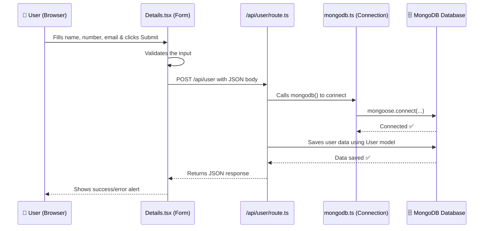

# 📖 Full Code Explanation — MongoDB Form Submission in Next.js

This document explains **every file** in your project that is involved in saving form data to MongoDB. We will go through each file one by one, line by line.

---

## 🗂️ Project Structure (Only the relevant files)

```
app/
├── Details.tsx              ← The Form (Frontend - what user sees)
├── lib/
│   ├── mongodb.ts           ← Database Connection
│   └── model/
│       └── user.ts          ← Database Schema (shape of your data)
└── api/
    └── user/
        └── route.ts         ← API Route (Backend - handles form submission)
```

---

## 📊 How the Data Flows

Here's the full journey of the data when a user clicks "Submit":



---

## File 1: `app/lib/mongodb.ts` — Database Connection

This file is responsible for **connecting your app to the MongoDB database**.

```typescript
import mongoose from 'mongoose'
```
- **`mongoose`** is a library that makes it easy to work with MongoDB from Node.js/TypeScript.
- Instead of writing raw MongoDB queries, Mongoose gives you a cleaner way to define data models and interact with the database.

```typescript
const mongodb = async () => {
```
- We create an **async function** called `mongodb`.
- It's `async` because connecting to a database takes time (it's a network operation), so we need to **wait** for it.

```typescript
    try {
        await mongoose.connect('mongodb://127.0.0.1:27017/Details');
        console.log('database connected sucess');
    }
```
- **`try`** block: We attempt to connect to MongoDB.
- **`mongoose.connect(...)`**: This is the actual connection command.
  - `mongodb://` → The protocol (like `https://` for websites)
  - `127.0.0.1` → This means **localhost** (your own computer)
  - `:27017` → The **port number** where MongoDB runs (27017 is the default)
  - `/Details` → The **database name**. If this database doesn't exist, MongoDB will automatically create it when you first insert data.
- **`await`**: We wait for the connection to finish before moving on.
- If successful, it prints "database connected sucess" in the terminal.

```typescript
    catch(err) {
        console.log("Database error ", err)
    }
```
- **`catch`** block: If the connection fails (e.g., MongoDB is not running), the error is caught here and printed to the terminal instead of crashing the app.

```typescript
export default mongodb
```
- We **export** the function so other files can import and use it.

---

## File 2: `app/lib/model/user.ts` — Database Schema/Model

This file defines the **shape (structure)** of the data that will be stored in MongoDB.

> **Think of it like this:** A schema is like a **form template**. It says "every user entry MUST have a name, a number, and an email."

```typescript
import mongoose, { mongo } from "mongoose";
```
- Imports `mongoose` to use its Schema and Model features.

```typescript
const UserSchema = new mongoose.Schema({
    name:   { type: String,  required: true },
    number: { type: Number,  required: true },
    email:  { type: String,  required: true },
});
```
- **`new mongoose.Schema({...})`**: Creates a new schema (blueprint).
- Each field is defined with:
  - **`type`**: What kind of data it stores (`String` for text, `Number` for numbers)
  - **`required: true`**: This field is **mandatory**. If you try to save data without it, Mongoose will throw an error.

| Field    | Type   | Required | What it stores          |
|----------|--------|----------|-------------------------|
| `name`   | String | ✅ Yes   | The user's name         |
| `number` | Number | ✅ Yes   | The user's phone number |
| `email`  | String | ✅ Yes   | The user's email        |

```typescript
const User = mongoose.models.user || mongoose.model("user", UserSchema);
```
This line is **very important**. Let's break it down:

- **`mongoose.model("user", UserSchema)`**: Creates a model called `"user"` based on the schema.
  - This tells Mongoose: "Create a **collection** called `users` in MongoDB (it adds an 's' automatically) and every document inside it must follow `UserSchema`."
- **`mongoose.models.user ||`**: This is a **safety check for Next.js**.
  - Next.js uses **hot reloading** during development — when you save a file, it reloads the code.
  - Without this check, Mongoose would try to create the same model again and throw an error: `"Cannot overwrite 'user' model once compiled"`.
  - So we first check: "Does this model already exist?" If yes, reuse it. If no, create it.

```typescript
export default User;
```
- Export the model so the API route can use it to save data.

---

## File 3: `app/api/user/route.ts` — API Route (Backend)

This is the **backend** of your app. When the form sends data, it arrives here. This file processes it and saves it to MongoDB.

> In Next.js, any file placed inside `app/api/` becomes an **API endpoint**. The folder structure determines the URL:
> `app/api/user/route.ts` → accessible at `http://localhost:3000/api/user`

```typescript
import { NextRequest, NextResponse } from "next/server";
```
- **`NextRequest`**: Represents the incoming request (the data sent from the form). *(Note: you're using `Request` in your code, which also works)*
- **`NextResponse`**: Used to send a response back to the frontend.

```typescript
import mongodb from "@/app/lib/mongodb";
```
- Imports the database connection function.
- **`@/`** is an alias for the project root — so `@/app/lib/mongodb` means `app/lib/mongodb.ts`.

```typescript
import User from "@/app/lib/model/user";
```
- Imports the User model (the blueprint) we defined earlier.

```typescript
export const POST = async (req: Request) => {
```
- **`export const POST`**: In Next.js App Router, the function name defines which **HTTP method** it handles.
  - `POST` → handles POST requests (used for **sending/creating** data)
  - `GET` → handles GET requests (used for **fetching** data)
- **`async`**: Because database operations take time.
- **`req: Request`**: The incoming request containing the form data.

```typescript
    await mongodb();
```
- **Connects to the database** before doing anything else.
- If the connection already exists (from a previous request), Mongoose will reuse it.

```typescript
    const data = await req.json();
```
- **`req.json()`**: Extracts the JSON body from the request.
- The form sent: `{ name: "John", number: "1234567890", email: "john@gmail.com" }`
- After this line, `data` contains that object.

```typescript
    const user = new User({
        name: data.name,
        number: data.number,
        email: data.email,
    });
```
- **`new User({...})`**: Creates a **new document** (entry) using the User model.
- This is like filling out the form template with actual values.
- At this point, the data is **NOT yet saved** to the database — it's just created in memory.

```typescript
    await user.save();
```
- **`user.save()`**: This is the line that actually **saves the data to MongoDB**.
- `await` ensures we wait for it to finish before sending a response.

```typescript
    return NextResponse.json({
        message: "user added successfully    ",
        user,
    });
```
- Sends a **JSON response** back to the frontend.
- Contains a success message and the saved user data (including the auto-generated `_id` from MongoDB).

---

## File 4: `app/Details.tsx` — The Form (Frontend)

This is what the user sees and interacts with in the browser.

```typescript
"use client"
```
- **Very important in Next.js!**
- By default, Next.js components run on the **server**.
- But this component uses `useState` (React state) and handles button clicks, which require the **browser (client)**.
- `"use client"` tells Next.js: "Run this component in the browser."

```typescript
import React, { useState } from 'react'
```
- **`useState`**: A React Hook that lets you store and update data that can change (like form inputs).

```typescript
const [name, setName] = useState('');
const [number, setNumber] = useState('');
const [email, setEmail] = useState('');
```
- Creates **3 state variables** to store the form values:

| Variable   | Setter       | Initial Value | What it stores     |
|------------|--------------|---------------|--------------------|
| `name`     | `setName`    | `''` (empty)  | User's typed name  |
| `number`   | `setNumber`  | `''` (empty)  | User's typed number|
| `email`    | `setEmail`   | `''` (empty)  | User's typed email |

- **`name`** holds the current value.
- **`setName`** is the function to update it.

### The `handleSubmit` Function

```typescript
const handleSubmit = async () => {
```
- Called when the user clicks the **Submit** button.
- `async` because we will use `await` for the API call.

#### Validation (Checking the data before sending):

```typescript
    if (name === "") {
        alert("Dont keep it blank  ")
    }
```
- If the name is empty → show an alert and **stop** (doesn't go to `else`).

```typescript
    else if (number.length !== 10) {
        alert("Number should be of  10 digit  ")
    }
```
- If the number is not exactly 10 digits → show an alert.

```typescript
    else if (!email.includes("@")) {
        alert("email should be valid")
    }
```
- If the email doesn't contain `@` → it's invalid → show an alert.

#### Sending Data to the API:

```typescript
    else {
        try {
            const res = await fetch("/api/user", {
                method: 'POST',
                headers: { "content-Type": "application/json" },
                body: JSON.stringify({ name, number, email }),
            });
```
- **`fetch("/api/user", {...})`**: Sends an HTTP request to your API route.
  - **`"/api/user"`**: The URL of your API (maps to `app/api/user/route.ts`)
  - **`method: 'POST'`**: We're sending data (not fetching)
  - **`headers`**: Tells the server that the body is in JSON format
  - **`body: JSON.stringify({name, number, email})`**: Converts the JavaScript object to a JSON string for sending
    - Example: `{ name: "John", number: "1234567890", email: "john@gmail.com" }`

```typescript
            const data = await res.json();
```
- Reads the **response** from the API and converts it from JSON to a JavaScript object.

```typescript
            if (res.ok) {
                alert("details added successfully");
                setName("");
                setNumber("");
                setEmail("");
            }
```
- **`res.ok`**: `true` if the HTTP status is 200-299 (success).
- If successful:
  - Shows a success alert
  - **Clears all the input fields** by setting them back to empty strings

```typescript
            else {
                alert("failed " + data.message)
            }
```
- If the API returned an error, show the error message.

```typescript
        catch(err) {
            console.log("Error", err)
            alert("something went wrong");
        }
```
- If something went completely wrong (e.g., network error, server crashed), catch the error and show a generic alert.

### The JSX (What you see on screen):

```typescript
<input type="text"
    className='bg-white rounded-full text-black p-1'
    value={name}
    onChange={(e) => setName(e.target.value)}
/>
```
- **`value={name}`**: The input always shows the current value of `name` state.
- **`onChange={(e) => setName(e.target.value)}`**: Every time the user types a character, it updates the `name` state with the new value.
- This pattern is called a **Controlled Component** — React controls the input value through state.

```typescript
<button onClick={handleSubmit}>Submit</button>
```
- When clicked, it calls `handleSubmit` which validates the data and sends it to the API.

---

## 🔑 Key Concepts Summary

| Concept | What it means |
|---|---|
| **`"use client"`** | Tells Next.js this component runs in the browser |
| **`useState`** | React hook to store data that can change |
| **`mongoose.Schema`** | Defines the structure/rules for your data |
| **`mongoose.model`** | Creates a "collection manager" based on the schema |
| **`mongoose.connect`** | Establishes connection to MongoDB |
| **`fetch()`** | Sends HTTP requests from the browser to the API |
| **`req.json()`** | Reads the JSON body from an incoming request |
| **`user.save()`** | Saves a document to MongoDB |
| **`NextResponse.json()`** | Sends a JSON response from the API |
| **API Route** | A backend endpoint created by placing `route.ts` inside `app/api/` |

---

## 🗄️ What Happens in MongoDB

After successful submission, your data is stored in:

- **Database**: `Details`
- **Collection**: `users` (Mongoose adds 's' to model name `"user"`)
- **Document** (example):

```json
{
    "_id": "664cba1f2e3a4b5c6d7e8f9a",
    "name": "John",
    "number": 1234567890,
    "email": "john@gmail.com",
    "__v": 0
}
```

- **`_id`**: Auto-generated unique ID by MongoDB
- **`__v`**: Version key added by Mongoose (used for internal tracking)
